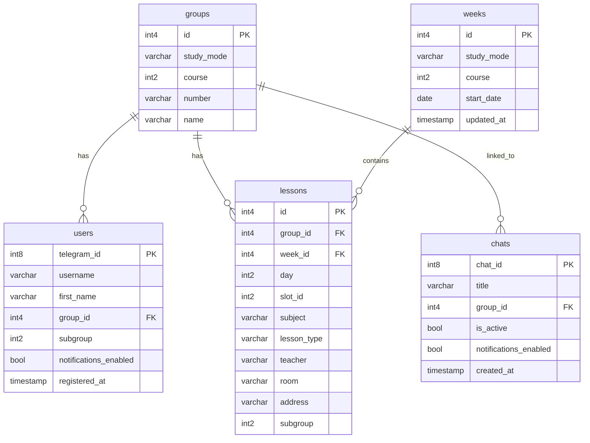

# 🦅 AvesSales (`avessales-bot`)

<p align="center">
  
  
  
  
  
  
</p>

**AvesSales** is a high-performance, asynchronous Telegram bot designed for students and faculty members of the Faculty of Biology at Belarusian State University (BSU). 

It automatically scrapes class schedules from the official faculty portal (`bio.bsu.by`), indexes them into an **In-Memory RAM Cache** for zero-latency ($O(1)$) responses, provides natural language schedule queries, detects schedule modifications via a **Smart Diff Engine**, and dispatches automated morning digests.

---

## ✨ Features

### 👤 Student Dashboard (Direct Messages)
* **Interactive 4-Step Registration (FSM):** Seamless onboarding to select Academic Course (1–4), Group Number, Subgroup (for foreign language/lab tracks), and Nickname.
* **Smart Schedule Views:**
  * 📅 **Today / 📆 Tomorrow** — Daily schedule formatted in clean native tables.
  * ⚡ **Current Class / Room Finder** — Detects active/upcoming classes, classroom numbers, and teacher details.
  * 🗓 **Full Week Navigation** — Interactive weekly overview with inline pagination (`◀️ Prev. Week` / `Next Week ▶️`).
* ⚠️ **Off-Campus Class Detection:** Automatically tags classes with `⚠️ (Address) — OFF-CAMPUS!` if the lesson is held outside the primary biology faculty building (Kurchatova 10).
* 🔔 **Morning Dispatch (07:45 Europe/Minsk):** Daily morning notification featuring the schedule of the day.
* ⚙️ **User Settings:** Quickly toggle notifications, switch subgroups, update display names, or re-register.

### 👥 Group Chats & Communities
* **Group Binding:** Chat administrators can configure course and group associations using `/chat_settings`.
* **Autonomous Message Parsing:** The bot understands schedule questions directly in the group chat without needing explicit `@mentions`.
* **Automated Daily Group Digests:** Sends the group's daily schedule every weekday at 07:45 AM.
* **Instant Health Ping:** Responds with *"Летаю! 🦅"* when prompted with `"Бот"`.

### 🧠 Natural Language Processing (NLP Engine)
A custom rule-based NLP parser processes conversational queries, typographical errors, and slang:
* *Time queries:* `"what do we have on tuesday?"`, `"classes on thursday"`, `"next week schedule"`
* *Pair lookups:* `"what is the 2nd class tomorrow?"`, `"where is our 3rd pair on mon?"`
* *Location queries:* `"where are we now?"`, `"what classroom are we in?"`, `"where to go?"`
* *Cross-group lookup:* `"what does 1-41 have on thu?"`, `"2-42 tomorrow"`, `"1-41 full week"`

### 👨‍🏫 Faculty & Teacher Lookup
* **Morphological Prefix Matching:** Matches teacher surnames across Russian cases (e.g., `Кукулянская`, `Гричик`, `пары Сауткина`, `расписание Рудакевич`).
* **Merged Stream Lectures:** Automatically identifies and merges joint multi-group lectures.
* **Teacher Directory (`/teachers`):** Provides a browsable list of all faculty professors stored in the database.

### 🔄 Auto-Sync & Smart Diff Detection
* **Periodic Background Sync:** Runs every 2 hours to pull data from `bio.bsu.by`.
* **Smart Diff Engine:** Computes exact differences between cached and newly fetched schedules (Detects: `ADDED`, `REMOVED`, `MODIFIED` rooms, times, or instructors).
* **Emergency Alerting:** Automatically broadcasts instant change notifications to affected students and group chats.

---

## 🛠 Tech Stack

| Domain | Technology / Library |
| :--- | :--- |
| **Language** | Python 3.11+ |
| **Telegram Framework** | [aiogram 3.x](https://github.com/aiogram/aiogram) (Asyncio, FSM, Routers, Custom Filters) |
| **Database** | PostgreSQL |
| **Async ORM & Driver** | [SQLAlchemy 2.0](https://www.sqlalchemy.org/) (Async Engine) + [asyncpg](https://github.com/MagicStack/asyncpg) |
| **HTTP Client** | [httpx](https://www.python-httpx.org/) (Connection pooling & async HTTP) |
| **Health Check Server** | [aiohttp](https://github.com/aio-libs/aiohttp) (HTTP dummy server on port `7860` for container monitoring) |
| **Containerization** | Docker (Alpine/Debian-slim multi-stage, non-root `appuser`) |

---

## 🏛 System Architecture

```
               ┌───────────────────────────┐
               │    bio.bsu.by (Source)    │
               └─────────────┬─────────────┘
                             │  HTTP (JSON API)
                             ▼
               ┌───────────────────────────┐
               │     BioBSUApiClient       │
               └─────────────┬─────────────┘
                             │
            ┌────────────────┴────────────────┐
            ▼                                 ▼
   ┌─────────────────┐               ┌─────────────────┐
   │   PostgreSQL    │               │  Smart Diff &   │
   │  (Persistence)  │               │ Change Detector │
   └────────┬────────┘               └────────┬────────┘
            │                                 │ (Broadcast Alerts)
            ▼                                 ▼
   ┌───────────────────────────────────────────────────┐
   │         In-Memory Cache (RAM O(1) Reads)          │
   │   • Fast Hash Maps   • Teacher Inverted Index     │
   │   • Week DTOs        • Atomic Pointer Swapping    │
   └────────────────────────┬──────────────────────────┘
                            │
                            ▼
               ┌───────────────────────────┐
               │    aiogram 3 Dispatcher   │
               ├───────────────────────────┤
               │ • NLP Query Parser        │
               │ • Rich Message Formatter  │
               │ • FSM Handlers & Routers  │
               └─────────────┬─────────────┘
                             │
                             ▼
                  Telegram Bot API Client
```

1. **In-Memory RAM Cache:** Reads operate entirely in-memory ($O(1)$ hash map lookups), eliminating database bottlenecks for user queries.
2. **Atomic Pointer Swapping:** Background synchronization constructs a new cache instance off-thread and atomically swaps memory references, preventing race conditions.
3. **Container Health Monitoring:** A lightweight `aiohttp` web server serves `/health` on port `7860`, ensuring full compatibility with Docker `HEALTHCHECK`, Render, Railway, and Hugging Face Spaces.

---

## 🗄 Database Schema (ERD)



---

## 📁 Project Structure

```text
avessales-bot/
├── config.py                 # Environment settings, logger setup, timezones, DB URLs
├── database.py               # Async SQLAlchemy engine and sessionmaker configuration
├── models.py                 # Declarative ORM models (User, Group, Week, Lesson, Chat)
├── keyboards.py              # Inline and Reply markup builders (Menus, Settings, Pagination)
├── main.py                   # Application entrypoint, aiohttp health server & polling loop
├── requirements.txt          # Python dependencies
├── Dockerfile                # Production Docker configuration (non-root user & healthcheck)
│
├── handlers/
│   ├── start.py              # User onboarding & FSM registration (/start)
│   ├── settings.py           # Personal settings, FAQ, Terms of Service (/settings)
│   ├── schedule.py           # Schedule queries, slot detection, and teacher search
│   ├── group_settings.py     # Community/Group chat management (/chat_settings)
│   └── admin.py              # Administrator control panel (/stats, /sync, /tech, /logs)
│
└── services/
    ├── api_client.py         # bio.bsu.by client, schedule synchronizer & Diff calculator
    ├── schedule_cache.py     # In-Memory RAM Cache with teacher morphological indexing
    ├── query_parser.py       # Rule-based natural language parser (NLP)
    ├── formatter.py          # Telegram Rich Message builder (Native block tables)
    ├── notifications.py      # Morning dispatch task & emergency change broadcasting
    └── dto.py                # Strongly-typed Data Transfer Objects (DTOs)
```

---

## 🚀 Installation & Setup

### Option 1: Local Development

#### 1. Clone the Repository
```bash
git clone https://github.com/Lolycut/avessales-bot.git
cd avessales-bot
```

#### 2. Configure Virtual Environment
```bash
python -m venv venv
source venv/bin/activate  # On Linux/macOS
# venv\Scripts\activate   # On Windows
pip install -r requirements.txt
```

#### 3. Configure Environment Variables
Create a `.env` file in the root directory:
```env
BOT_TOKEN=1234567890:ABCdefGHIjklMNOpqrSTUvwxYZ
ADMIN_IDS=123456789,987654321

DB_USER=postgres
DB_PASSWORD=your_secure_password
DB_HOST=localhost
DB_PORT=5432
DB_NAME=bio_schedule_db

PORT=7860
```

#### 4. Run the Bot
```bash
python main.py
```

---

### Option 2: Docker Deployment

#### 1. Build the Docker Image
```bash
docker build -t avessales-bot .
```

#### 2. Run the Container
```bash
docker run -d \
  --name avessales_bot \
  --restart unless-stopped \
  --env-file .env \
  -p 7860:7860 \
  avessales-bot
```

---

## 👑 Administrator Suite

Restricted to IDs specified in `ADMIN_IDS`:

* `/admin` or `/ahelp` — Displays admin panel and available commands.
* `/stats` — Comprehensive breakdown of users, active chats, PostgreSQL entities, and In-Memory cache statistics.
* `/allstats` — Course-by-course and group-by-group student & chat distribution metrics.
* `/sync` — Forces an immediate full resynchronization against `bio.bsu.by` and outputs detected differences.
* `/tech <message>` — Broadcasts a technical notification to all registered users and chats with rate-limit handling.
* `/logs` — Downloads the active `bot.log` file directly inside Telegram.

---

## 📄 User Commands Reference

| Command | Scope | Description |
| :--- | :--- | :--- |
| `/start` | Private | Starts registration or opens the main menu |
| `/help`, `/faq` | All | Displays bot help and example queries |
| `/teachers`, `/prep`| All | Lists all known faculty instructors |
| `/chat_settings` | Groups | Opens group configuration menu (Admins only) |
| `/grouphelp` | Groups | Setup guide for group chats and community management |
| `/terms`, `/privacy` | All | Displays privacy terms and disclaimer |

---

## ⚖️ Disclaimer & License

* **Disclaimer:** **AvesSales** is an independent student-led open-source project and is **not an official service** of Belarusian State University (BSU). All schedule data is retrieved automatically from open public sources (`bio.bsu.by`).
* **License:** Licensed under the [MIT License](LICENSE).
